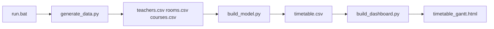

# Smart Timetable Scheduler — UI/UX Upgrade Plan

## Current state (inspected)

### Architecture and data flow

| Stage | File | Role |
|-------|------|------|
| Entry | [`run.bat`](d:\School_Timetable_Fresh\run.bat) | venv + 3 steps: data → model → dashboard; opens `output/timetable_gantt.html` |
| Data | [`src/data_generation/generate_data.py`](d:\School_Timetable_Fresh\src\data_generation\generate_data.py) | Faker teachers, rooms (capacity in CSV only), 15 courses, `weekly_classes=1` |
| Model | [`src/model/build_model.py`](d:\School_Timetable_Fresh\src\model\build_model.py) | DOcplex MIP; writes `timetable.csv` only |
| UI | [`src/visualization/build_dashboard.py`](d:\School_Timetable_Fresh\src\visualization\build_dashboard.py) | Plotly Gantt + day×time grid + raw CSV tables; **single output HTML** |
| Styles | [`src/web/style.css`](d:\School_Timetable_Fresh\src\web/style.css) | Referenced as `../web/style.css` from `output/` — **broken** (no `web/` at repo root; nginx/Docker serve **only** [`output/`](d:\School_Timetable_Fresh\output)) |

### Implemented CPLEX constraints (document these only)

From [`build_model.py`](d:\School_Timetable_Fresh\src\model\build_model.py) — **do not claim room-capacity or duplicate-course rules in the UI**:

1. **Course coverage** — each course scheduled exactly `weekly_classes` times per week.
2. **Room exclusivity** — at most one class per room per (day, period).
3. **Section exclusivity** — at most one class per section per (day, period) across rooms.
4. **Teacher exclusivity** — at most one class per teacher per (day, period) across rooms.
5. **Objective** — minimize assignments in period 3 (late-period penalty); MIP with binary vars `x[c,r,day,period]`.

**Not in the model:** room capacity vs class size (capacity exists in [`rooms.csv`](d:\School_Timetable_Fresh\src\data_generation\generate_data.py) but is unused). Conflict UI will **not** report capacity violations; the Constraints panel will state capacity is informational only.

### Existing UI gaps vs your spec

- Header title/subtitle in [`config.py`](d:\School_Timetable_Fresh\config.py) (`College Timetable`) — rebrand to **Smart Timetable Scheduler** / **Optimization-based Academic Scheduling**.
- KPI row exists (4 cards) but missing: time slots, required vs scheduled, optimization status, objective value.
- No optimization summary file (metrics printed in console only).
- No filters, teacher/room/course alternate views, utilization/workload bars, conflict section, pipeline/About, exports, sidebar, or empty-state handling (`pd.read_csv` will crash if CSV missing).
- Gantt works (Plotly timeline, room on Y-axis, range slider) — enhance labels/legend/hover, keep chart.
- No in-browser “Generate Timetable” / loading steps (batch pipeline only) — **out of scope** unless you later add a small server; show friendly empty state + “Run `run.bat`” instead.

---

## Design approach

**Presentation-first:** keep the batch pipeline (`run.bat` → three Python modules). The “app” remains a **generated static site** under `output/` suitable for local open + Docker/nginx.

**Client-side interactivity:** embed timetable + dimension tables + period times + optimization summary as JSON in the HTML (or a sibling `output/dashboard-data.json` loaded by `output/app.js`). Filters and alternate views re-render DOM from that data — no change to CPLEX.

**Asset delivery fix:** during dashboard build, copy [`src/web/style.css`](d:\School_Timetable_Fresh\src\web\style.css) → `output/style.css` and emit `output/app.js` (or inline script if you prefer one file; separate files are easier to maintain). HTML links `href="style.css"` and `src="app.js"` so nginx root `/app/output` works.

**Minimal backend addition (metadata only):** after successful solve in `build_model.py`, write [`output/optimization_summary.json`](d:\School_Timetable_Fresh\output\optimization_summary.json) with fields safe to expose:

- `solver_status` (from DOcplex after `model.solve()`)
- `objective_value`
- `num_decision_variables` (`len(x)`)
- `num_constraints` (`model.number_of_constraints`)
- `required_weekly_classes` (`courses["weekly_classes"].sum()`)
- `scheduled_classes` (`len(timetable_df)`)
- `timestamp` / model name (optional)

No changes to variables, constraints, objective, or extraction loop.

---

## Module layout (light refactor, not full tree move)

Keep [`src/visualization/build_dashboard.py`](d:\School_Timetable_Fresh\src\visualization\build_dashboard.py) as the orchestrator; extract helpers to avoid a 2000-line file:

| New module | Responsibility |
|------------|----------------|
| [`src/visualization/analytics.py`](d:\School_Timetable_Fresh\src\visualization\analytics.py) | KPIs, teacher workload, room slot utilization (% of day×period slots used per room), post-hoc conflict detection on `timetable.csv`, unscheduled count |
| [`src/visualization/html_templates.py`](d:\School_Timetable_Fresh\src\visualization\html_templates.py) | Section builders: header, sidebar, dashboard cards, constraint copy, pipeline, dataset tables, empty state |
| [`src/web/app.js`](d:\School_Timetable_Fresh\src\web\app.js) | Navigation, filters (teacher/room/course/day), weekly grid render, teacher/room/course list views, print handler |
| [`src/web/style.css`](d:\School_Timetable_Fresh\src\web\style.css) | Sidebar layout, KPI cards, status pills (green/yellow/red), utilization bars, filter bar, responsive rules |

Update [`config.py`](d:\School_Timetable_Fresh\config.py): `PROJECT_TITLE`, `PROJECT_SUBTITLE`, `PAGE_TITLE`, fix `WEB_DIR = BASE_DIR / "src" / "web"` for copy paths; optional tech badge strings.

---

## UI structure (single page, sidebar + sections)

Replace top-only tabs with **left sidebar** (your nav list). Each nav item shows one `<section>`; active item highlighted. Mobile: collapsible sidebar or horizontal scroll nav.

### 1. Dashboard (default)

- **Header:** Smart Timetable Scheduler, subtitle, badges (Python, IBM CPLEX, Linear Programming, Faker).
- **KPI cards (computed):** total courses, teachers, rooms, time slots (`len(DAYS)*len(PERIODS)`), scheduled classes, unscheduled (`required - scheduled`), optimization status, objective value (from JSON or N/A).
- **Optimization summary:** status indicator, objective, constraints/variables counts, scheduled fraction, conflict count (from analytics).
- **Room utilization:** bar per room = scheduled slots / (days × periods) for that room.
- **Teacher workload:** bar = count of timetable rows per `teacher_id` (join `teacher_name` for labels).
- **Scheduling conflicts:** list teacher/room/section double-bookings if any; else “No scheduling conflicts detected” (validation on **output** timetable, not rewriting the solver).
- **How it works:** static pipeline diagram (same content as About, shorter).

### 2. Timetable

- **Weekly grid** (primary): rows = days, cols = periods with times from `PERIOD_TIMES`; cells show course, teacher, room, section (match existing card styling, subdued colors).
- **Filter bar:** dropdowns for teacher, room, course, day (“All” + values from data); JS filters rows/cells without regenerating CPLEX output.

### 3. Teachers / Rooms / Courses

- **Entity views:** grouped lists (e.g. Teacher T01 → Mon 09:00–10:00 Python R02) generated by JS from JSON.
- **Dataset tables:** existing pandas `to_html` previews (teachers, rooms, courses) moved here.

### 4. Gantt Chart

- Keep Plotly timeline in this section.
- Improvements: clearer title/subtitle, hover template with day, time range, subject, teacher, room; legend for `COLOR_BY`; retain range slider; responsive width in CSS wrapper.

### 5. Optimization

- **Scheduling rules panel:** the four real constraints + objective explained in plain language (purpose bullets).
- **Technical details (expandable):** MIP/binary LP, DOcplex, CPLEX, Faker, CSV + HTML outputs; show JSON stats when present.
- **Dataset summary:** counts, period definitions, note that room capacity is not enforced.

### 6. About

- Recruiter-oriented narrative: problem, approach, architecture diagram (mermaid or simple HTML steps), link to README sections.

### 7. Export actions (header or Timetable toolbar)

- **Download Timetable CSV** → `href="timetable.csv"` (same folder).
- **Download HTML** → `href="timetable_gantt.html"`.
- **Print Timetable** → `window.print()` with `@media print` CSS hiding sidebar/filters.

---

## Empty and error states

Wrap dashboard generation in [`build_dashboard.py`](d:\School_Timetable_Fresh\src\visualization\build_dashboard.py):

- If `timetable.csv` or input CSVs missing → write `timetable_gantt.html` with empty-state message, steps to run [`run.bat`](d:\School_Timetable_Fresh\run.bat), no uncaught exception.
- If CSV malformed → catch `pd.errors` / empty frame → friendly message.
- If `optimization_summary.json` missing but timetable exists → show KPIs from CSV only; optimization fields **N/A**.

---

## Gantt + backward compatibility

- **Output filename unchanged:** `output/timetable_gantt.html` (so `run.bat`, Jenkins, [`Deploy/nginx/default.conf`](d:\School_Timetable_Fresh\Deploy\nginx\default.conf) keep working).
- CPLEX output CSV schema unchanged.

---

## README

Replace/expand root [`README.md`](d:\School_Timetable_Fresh\README.md) with recruiter-friendly sections you listed: overview, problem, tech stack, architecture (reuse mermaid flow), optimization/constraints (**accurate list**), features, how to run (`run.bat` / manual module commands), sample outputs, screenshots placeholder, future improvements (UI-triggered run, capacity constraints, teacher availability).

Optionally align [`ReadMe_All/README_Python37.md`](d:\School_Timetable_Fresh\ReadMe_All\README_Python37.md) constraint bullet that mentions room capacity — mark as future/not implemented.

---

## Deploy note (small fix, optional in same PR)

[`Dockerfile`](d:\School_Timetable_Fresh\Dockerfile) copies `web/` at repo root but styles live under `src/web/`. When touching deploy, fix copy to `src/web/` (or rely on dashboard copy into `output/` at build time). Nginx already serves `output/` only.

---

## Verification checklist (post-implementation)

1. Run full pipeline; confirm `timetable.csv` row count and assignments unchanged vs pre-UI baseline (same seed `RANDOM_SEED=42`).
2. Open `output/timetable_gantt.html` locally — CSS/JS load, sidebar works, filters update grid.
3. Confirm constraint text matches code; no “AI” claims; no capacity constraint claimed.
4. Delete `timetable.csv` and re-run dashboard step only — empty state HTML, no traceback.
5. Document: files changed, run instructions, no new Python dependencies (unless we add none — expected **zero** new packages).

---

## Risk summary

| Risk | Mitigation |
|------|------------|
| Breaking CPLEX | Only append JSON write after existing save block in `build_model.py` |
| Broken styling in Docker | Copy CSS/JS into `output/` on every dashboard build |
| False conflict claims | Detect only teacher/room/section double-bookings in same (day, period) |
| Over-scoping server/loading UI | Explicitly not adding; README lists as future work |
