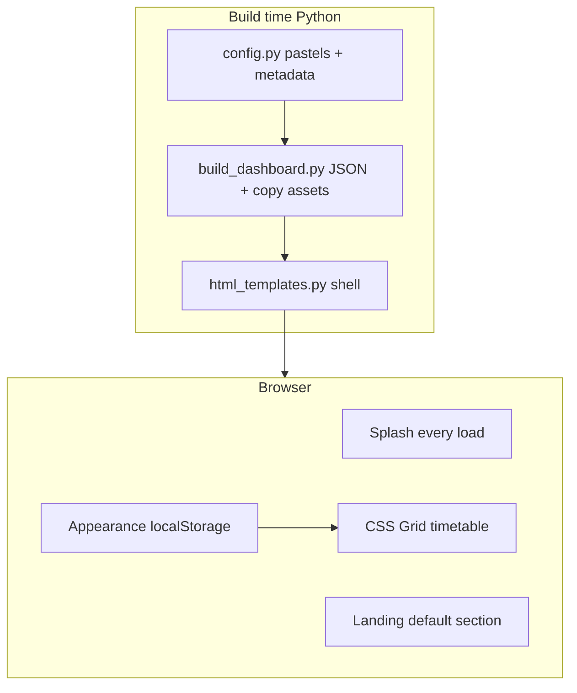

# Modern landing page, grid timetable, themes & appearance

## Context

The app is a **batch-generated static site**: [`run.bat`](d:\School_Timetable_Fresh\run.bat) → [`build_dashboard.py`](d:\School_Timetable_Fresh\src\visualization\build_dashboard.py) writes [`output/timetable_gantt.html`](d:\School_Timetable_Fresh\output\timetable_gantt.html) plus copied [`src/web/style.css`](d:\School_Timetable_Fresh\src\web\style.css) and [`src/web/app.js`](d:\School_Timetable_Fresh\src\web\app.js). Today the **Timetable** tab is default, the weekly view is an **HTML `<table>`** with variable cell height, lesson cards use **tint + left border** (see [`cellInnerHtml`](d:\School_Timetable_Fresh\src\web\app.js)), and colors come from saturated [`COLOR_PALETTE`](d:\School_Timetable_Fresh\config.py) in config.

Your request maps to **presentation-only** changes in `src/web/*`, `html_templates.py`, `config.py`, and asset copy in `build_dashboard.py`.

---

## 1. Default landing page (modern home)

**[`html_templates.py`](d:\School_Timetable_Fresh\src\visualization\html_templates.py)**

- Add `<section id="section-home" class="page-section active">` with a **modern hero**: project title, subtitle from [`PROJECT_SUBTITLE`](d:\School_Timetable_Fresh\config.py), school/year, tech badges.
- **Quick stats row** (reuse KPI numbers already in embedded JSON—no new backend): courses, teachers, rooms, scheduled classes, optimization status pill.
- **Primary CTAs**: “View weekly timetable”, “Analytics & insights” (JS switches nav + section, same pattern as existing [`initNavigation`](d:\School_Timetable_Fresh\src\web\app.js)).
- Optional **feature cards** (3–4): optimization-backed scheduling, filters, export/print, Gantt—each links to an existing section.

**Nav order:** `Home` first; remove `active` from Timetable; Timetable becomes second tab.

**[`style.css`](d:\School_Timetable_Fresh\src\web\style.css):** hero layout (gradient or soft mesh using theme CSS variables), responsive card grid, consistent with updated header (slightly taller, subtle shadow).

---

## 2. Equal-size timetable grid (not table layout)

**Problem:** `<table>` + stacked `.school-cell-lesson` blocks grow row height when multiple sections appear in one slot.

**Approach:** Replace table markup in [`renderSchoolTimetable`](d:\School_Timetable_Fresh\src\web\app.js) with a **CSS Grid** shell:

| Area | Implementation |
|------|----------------|
| Columns | `110px` time gutter + `repeat(5, 1fr)` tied to `data.days` (fixed at 5 in [`config.DAYS`](d:\School_Timetable_Fresh\config.py)) |
| Period rows | Fixed height e.g. `--slot-height: 104px` (CSS variable, theme-adjustable) |
| Break rows | Full-width row spanning all columns (Lunch), fixed shorter height |
| Cells | `.grid-slot` with `min-height`/`height` = slot height; **no row growth** |

**Multiple lessons in one slot** (when “All Sections” filter shows >1): each lesson is a **fixed-height tile** inside the slot (`flex` column, equal `flex: 1` with `min-height: 0`); if overflow, **thin scroll** inside the cell (still outer cell size fixed). Empty slot: centered em dash in a full-size placeholder.

**Shared renderer:** Teacher and room timetable containers reuse the same grid function (already call `renderSchoolTimetable` with different containers/filters).

**Print:** Update `@media print` rules to target `.timetable-grid` instead of `.school-timetable` table.

---

## 3. Full pastel blocks + border customization

**Pastel fill (build time + runtime)**

- Replace [`COLOR_PALETTE`](d:\School_Timetable_Fresh\config.py) with **pastel hex** values (soft saturation, readable dark text on fill).
- Keep `create_color_map()` in [`build_dashboard.py`](d:\School_Timetable_Fresh\src\visualization\build_dashboard.py) for Gantt + default `colorMap` in JSON.
- Extend JSON with:
  - `pastelPalette`: default swatches
  - `teachers`: ids list (from timetable/teachers CSV)
  - `borderColorKeys`: `days` + teacher ids for picker UI

**Runtime styling in `app.js`**

- **Fill:** solid pastel background on `.school-cell-lesson` (remove `22` alpha hack and default thick left-only accent).
- **Border:** separate rule driven by user setting:
  - `borderMode`: `teacher` | `day` | `course` | `none`
  - `borderWidth`: 3px default; optional style descriptor in UI (“Accent border identifies teacher/day”)
- Resolve colors from maps: `fillMap` (course → pastel), `borderMap` (teacher or day → slightly deeper pastel / contrast stroke).
- **Defaults:** fill by course; border by teacher.

**Appearance panel — color editors**

- Collapsible **“Appearance”** drawer (header button or floating gear); **hide/unhide** toggle as requested.
- Subsections:
  - Theme (below)
  - Font pair (below)
  - Border mode dropdown + legend text
  - **Pastel palette:** list of courses (and teachers/days when border mode active) with `<input type="color">` + reset-to-default
- **Persistence:** `localStorage` keys (`sts-theme`, `sts-font`, `sts-border-mode`, `sts-colors-fill`, `sts-colors-border`); apply on load before first paint where possible (`body` class + inline script stub optional to reduce flash).

**Gantt:** pass the same resolved `color_discrete_map` logic client-side is not applicable to Plotly embed—keep Python-generated Gantt colors aligned with updated pastel palette in `build_dashboard.py` only.

---

## 4. Font pair palette + hide/unhide selectors

**Google Fonts** (loaded in HTML `<head>`): preload 4–5 pairs, e.g.

| Pair id | Display | Heading | Body |
|---------|---------|---------|------|
| `modern` | Modern | DM Sans | Inter |
| `classic` | Classic | Playfair Display | Source Sans 3 |
| `technical` | Technical | Space Grotesk | IBM Plex Sans |
| `friendly` | Friendly | Nunito | Nunito Sans |
| `editorial` | Editorial | Libre Baskerville | Lato |

**CSS:** `[data-font="modern"] { --font-heading: ...; --font-body: ...; }` applied to `html`; `body` uses `--font-body`, headings/nav/hero use `--font-heading`.

**UI:** Inside Appearance panel, `<select id="font-pair">` + live preview line; hidden when panel collapsed.

Define pair metadata in [`config.py`](d:\School_Timetable_Fresh\config.py) as `FONT_PAIRS` JSON-serialized into dashboard data for labels only (URLs built in template).

---

## 5. Site themes (light, dark, literary)

Use **`data-theme`** on `<html>`** with CSS variables for surfaces, text, borders, header, slot grid lines, KPI cards.

| Theme id | Label | Character |
|----------|-------|-----------|
| `light` | Light | Current clean admin look (refined) |
| `dark` | Dark | Navy/slate surfaces, light text, muted pastels on blocks |
| `library` | The Library | Warm cream paper, walnut accents, serif-forward |
| `manuscript` | Manuscript | Sepia/parchment, ink borders, soft gold highlights |
| `midnight-scholar` | Midnight Scholar | Deep green-black, candle-gold accents (literary “study”) |

**UI:** theme `<select>` in Appearance panel; all sections (landing, analytics, tables) consume variables—audit hard-coded `#fff` / `#1a2332` in [`style.css`](d:\School_Timetable_Fresh\src\web\style.css) and replace with tokens.

Plotly Gantt iframe/div: wrap in `.gantt-wrapper` with theme-aware background; chart template in `build_gantt_html` may set paper bgcolor from a constant per theme is **not** dynamic—acceptable limitation unless we add a small JS relayout later; note in README as display-only.

---

## 6. Favicon + splash (every load)

**Assets** under [`src/web/assets/`](d:\School_Timetable_Fresh\src\web\assets\):

- `favicon.svg` — simple grid/calendar mark using brand indigo + pastel tile (works at 32px).
- Optional `apple-touch-icon.png` skipped unless needed; SVG + `favicon.ico` duplicate optional.

**[`build_dashboard.py`](d:\School_Timetable_Fresh\src\visualization\build_dashboard.py):** extend `copy_web_assets()` to copy `assets/*` → `output/`.

**HTML head:** `<link rel="icon" href="assets/favicon.svg" type="image/svg+xml">`.

**Splash overlay** (in template + CSS + `app.js`):

- Full viewport, **orange field** (#FF6B00-ish) matching reference image.
- Word **`timetable`** in **Lobster** (or **Pacifico** fallback) — white fill, **stacked `text-shadow`** for black retro extrusion (screenshot 2).
- **Every page load:** show overlay ~1.2–1.8s with fade-out (your choice: `every_load`); `prefers-reduced-motion`: skip animation, instant hide.
- Does not block interaction after dismiss; no localStorage skip.

**Empty state** [`render_empty_state`](d:\School_Timetable_Fresh\src\visualization\html_templates.py): reuse same favicon + minimal splash/CSS so experience is consistent when CSV missing.

---

## 7. Files to touch (concise)

| File | Changes |
|------|---------|
| [`config.py`](d:\School_Timetable_Fresh\config.py) | Pastel `COLOR_PALETTE`; `FONT_PAIRS`; optional `THEME_IDS` labels |
| [`src/web/app.js`](d:\School_Timetable_Fresh\src\web\app.js) | Grid renderer; appearance module; splash; theme/font/color apply; nav default home |
| [`src/web/style.css`](d:\School_Timetable_Fresh\src\web\style.css) | Theme tokens, landing, grid, lesson tiles, appearance drawer, splash |
| [`src/visualization/html_templates.py`](d:\School_Timetable_Fresh\src\visualization\html_templates.py) | Home section, appearance panel, splash DOM, fonts link, favicon, nav |
| [`src/visualization/build_dashboard.py`](d:\School_Timetable_Fresh\src\visualization\build_dashboard.py) | JSON extras; copy assets folder |
| `src/web/assets/favicon.svg` | New |
| [`README.md`](d:\School_Timetable_Fresh\README.md) | Short “Appearance & themes” user note (optional one paragraph) |

**Out of scope (unchanged):** CPLEX model, CSV schema, output filename `timetable_gantt.html`, Jenkins/Docker entrypoints.

---

## 8. Verification

1. Run full pipeline; open `output/timetable_gantt.html` — splash plays each reload; **Home** is default.
2. Timetable grid: all day×period cells **same outer size**; pastel **solid** fills; border changes when switching border mode / custom colors.
3. Toggle Appearance panel: theme dark + font editorial + reset colors — persists after refresh.
4. Teacher/Room sub-grids use same fixed grid behavior.
5. Print timetable still hides chrome and shows grid.
6. Delete timetable → empty state still loads CSS, favicon, splash.

---

## Risks and mitigations

| Risk | Mitigation |
|------|------------|
| Flash of wrong theme | Apply `data-theme` / `data-font` from localStorage in small inline script in `<head>` before body |
| Many Google Fonts | Load only used families via single `fonts.googleapis.com` URL with `display=swap` |
| Multi-lesson cells cramped | Fixed slot height + internal scroll; recommend single-section filter in tooltip on landing CTA |
| Gantt not theme-synced | Document as static chart colors from build-time palette |
