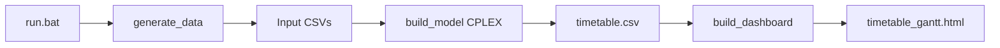

# Smart Timetable Scheduler

Optimization-based school timetable management: sample academic data is generated with **Faker**, scheduling rules are encoded as a **mixed integer program**, and **IBM CPLEX** (via **DOcplex**) produces a weekly timetable. Results are exported as **CSV** and an interactive **HTML dashboard** with Gantt chart, filters, and analytics.

## Project Overview

This application assigns courses to rooms, days, and time periods while respecting teacher, room, and section conflicts. The UI presents KPIs, weekly and entity-specific views, room utilization, teacher workload, conflict checks on the output, and documentation of the real optimization constraints.

## Problem Statement

Colleges need feasible weekly timetables where:

- Each course meets its required number of weekly sessions
- No room double-booking
- No teacher double-booking
- No section (student group) double-booking

The solver also prefers schedules that avoid placing classes in the last period of the day when possible.

## Technologies Used

| Area | Stack |
|------|--------|
| Language | Python |
| Optimization | IBM CPLEX, DOcplex (MIP) |
| Data | Faker, pandas |
| Visualization | Plotly, static HTML/CSS/JS |

## Architecture

```
run.bat
   │
   ├── src/data_generation/generate_data.py  →  output/teachers.csv, rooms.csv, courses.csv
   │
   ├── src/model/build_model.py               →  output/timetable.csv, optimization_summary.json
   │
   └── src/visualization/build_dashboard.py  →  output/timetable_gantt.html, style.css, app.js
```



## Optimization Approach

- **Decision variables:** binary `x[course, room, day, period]` — 1 if that assignment is chosen
- **Objective:** minimize total assignments in period 3 (late-period penalty)
- **Technique:** Mixed Integer Programming (binary variables)

## Constraints (implemented in code)

1. **Course coverage** — each course scheduled exactly `weekly_classes` times per week  
2. **Room exclusivity** — at most one class per room per (day, period)  
3. **Section exclusivity** — at most one class per section per (day, period)  
4. **Teacher exclusivity** — at most one class per teacher per (day, period)  

**Not implemented:** room capacity vs. class size (capacity is stored in `rooms.csv` for reference only).

## Features

- Modern landing page (Home), weekly CSS grid timetable, and Appearance panel (themes, font pairs, pastel fill and border colors — saved in your browser)
- KPI cards and optimization summary (from `optimization_summary.json` when available)
- Weekly timetable grid with filters (teacher, room, course, day)
- Teacher, room, and course grouped views
- Plotly Gantt chart (room timeline, range slider)
- Room utilization and teacher workload charts
- Post-hoc conflict detection on timetable output
- Scheduling rules and technical details panels
- CSV / HTML download links and print-friendly timetable view
- Empty-state HTML when outputs are missing

## Screenshots

After running the pipeline, open `output/timetable_gantt.html` in a browser. (Add screenshots to your portfolio as needed.)

## How to Run

### Windows (recommended)

```bat
run.bat
```

This creates/uses `.TIMEenvTABLE`, installs dependencies, runs all three steps, and opens the dashboard.

### Manual steps (from project root)

```bash
python -m src.data_generation.generate_data
python -m src.model.build_model
python -m src.visualization.build_dashboard
```

Requires a valid **CPLEX** installation licensed for DOcplex.

### Docker

Build runs data → model → dashboard in the **builder** stage; the **runtime** image contains only nginx plus pruned `output/` (see [`Dockerfile`](Dockerfile) and [`Deploy/nginx/default.conf`](Deploy/nginx/default.conf)).

**Build on the server (or locally):**

```bash
docker build -t school-timetable-fresh:latest .
```

During `apt-get install nginx` you may see `policy-rc.d denied execution of start` — that is **normal** in Docker builds (services must not start until the container runs). The image can still build successfully.

**Run — port mapping (`-p HOST:CONTAINER`):**

nginx listens on **port 80 inside the container**. On the shared droplet, **host 80/443** are Zyrowaste and **8080** is Jenkins — bind **8090** on the host for this app.

```bash
docker rm -f school-timetable-fresh 2>/dev/null || true

docker run -d \
  --name school-timetable-fresh \
  --restart unless-stopped \
  -p 8090:80 \
  school-timetable-fresh:latest
```

| Mapping | Meaning | Use here? |
|---------|---------|-----------|
| `-p 8090:80` | Host **8090** → container **80** | **Yes** (production on shared droplet) |
| `-p 80:8080` | Host **80** → container **8080** | **No** — wrong container port; host 80 usually **already in use** |

Verify: `curl -f http://127.0.0.1:8090/health` on the server, or open `http://143.244.128.22:8090/`.

**Preferred on the server:** `docker compose -p school-timetable up -d` with `APP_PORT=8090` (see [`docker-compose.yml`](docker-compose.yml) or [`Deploy/scripts/deploy.sh`](Deploy/scripts/deploy.sh)).

### Output files (replace on each run)

The pipeline uses **fixed paths** under `output/` — every run **overwrites** the same filenames (no dated copies). The dashboard step clears old HTML/CSS/JS before rebuilding and drops duplicate `dashboard-data.json` (data is embedded in the HTML). Docker uses a **multi-stage build**: CPLEX runs in the builder stage; the runtime image contains only nginx plus the pruned `output/` tree. Compose **does not mount an output volume**, so each deploy shows exactly what is in the new image. If you previously used the `school_timetable_output` volume, remove it once: `docker volume rm school_timetable_output`.

## Sample Output

| File | Description |
|------|-------------|
| `output/teachers.csv` | Teacher IDs and names |
| `output/rooms.csv` | Room IDs and capacities |
| `output/courses.csv` | Courses, teachers, sections, weekly class count |
| `output/timetable.csv` | Optimized schedule |
| `output/optimization_summary.json` | Solver status, objective, model size |
| `output/timetable_gantt.html` | Full dashboard |
| `output/style.css`, `output/app.js` | Copied assets for offline/nginx serving |

## Project Layout

```
School_Timetable_Fresh/
├── config.py
├── run.bat
├── requirements.txt
├── src/
│   ├── data_generation/generate_data.py
│   ├── model/build_model.py
│   ├── visualization/
│   │   ├── analytics.py
│   │   ├── html_templates.py
│   │   └── build_dashboard.py
│   └── web/
│       ├── style.css
│       └── app.js
└── output/          (generated)
```

## Future Improvements

- Enforce room capacity and enrollment in the model
- Teacher availability and preferences
- UI-triggered generation with progress (requires a small backend or local runner)
- Multi-semester and richer period definitions
- Automated tests for dashboard analytics

## Limitations

- Timetable generation is batch-only (`run.bat` / CLI); the HTML UI does not run CPLEX in the browser
- Loading/progress steps during solve are not shown in the UI (console only during `build_model`)
- Conflict panel validates the **exported** timetable; it does not change the solver

## Software Development Life Cycle (SDLC)

This project follows a practical SDLC aligned with a **batch optimization pipeline** and a **static dashboard** served in production. Stages map to folders and automation in this repository.

```mermaid
flowchart TB
  subgraph plan [1 Planning]
    req[Requirements and constraints]
    cfg[config.py timetable settings]
  end
  subgraph design [2 Design]
    mip[MIP model design]
    ui[Dashboard UX and themes]
    deployPlan[Deploy SHARED_DROPLET_PLAN]
  end
  subgraph build [3 Implementation]
    gen[generate_data]
    model[build_model]
    dash[build_dashboard]
    web[src/web CSS and JS]
  end
  subgraph test [4 Testing and QA]
    local[run.bat local pipeline]
    jenkinsVal[Jenkins validate output]
    dockerTest[Jenkins Docker smoke test]
  end
  subgraph ci [5 CI/CD]
    jenkins[Jenkinsfile build and push]
    ghcr[Container registry GHCR]
  end
  subgraph release [6 Deployment]
    image[Multi-stage Docker image]
    ssh[Deploy scripts SSH]
    prod[Droplet :8090 nginx]
  end
  subgraph ops [7 Operations]
    health[/health check]
    rollback[rollback.sh]
  end
  subgraph maintain [8 Maintenance]
    fix[Model or UI fixes]
    redeploy[New image tag deploy]
  end
  plan --> design --> build --> test --> ci --> release --> ops --> maintain
  maintain --> build
```

### 1. Planning and requirements

| Activity | Outcome in this repo |
|----------|----------------------|
| Problem definition | Course, room, teacher, section scheduling with CPLEX |
| Scope | Batch generation; no in-browser solver |
| Configuration | [`config.py`](config.py) — days, periods, palette, school metadata |
| Deployment target | Shared DigitalOcean droplet with Zyrowaste — [`Deploy/SHARED_DROPLET_PLAN.md`](Deploy/SHARED_DROPLET_PLAN.md) |

**Entry criteria:** constraints and timetable dimensions agreed. **Exit criteria:** `config.py` and README constraint list match [`build_model.py`](src/model/build_model.py).

### 2. Analysis and design

| Layer | Design artifact |
|-------|-----------------|
| Optimization | Binary MIP variables, four exclusivity constraints, late-period objective |
| Data | Faker-generated CSV schema under `output/` |
| Presentation | Static HTML dashboard, embedded JSON, client-side filters and themes |
| Serving | nginx serves pruned `output/`; multi-stage Docker separates build vs runtime |
| CI/CD | Root [`Jenkinsfile`](Jenkinsfile); prod SSH via [`Deploy/scripts/`](Deploy/scripts/) |

Templates for operators (not auto-used): [`Deploy/examples/`](Deploy/examples/) and [`Deploy/droplet.env.example`](Deploy/droplet.env.example).

### 3. Implementation (development)

| Step | Command / location |
|------|---------------------|
| Local setup | `run.bat` or venv + `pip install -r requirements.txt` |
| Generate data | `python -m src.data_generation.generate_data` |
| Optimize | `python -m src.model.build_model` (requires CPLEX) |
| Build UI | `python -m src.visualization.build_dashboard` |
| Front-end assets | Edit [`src/web/style.css`](src/web/style.css), [`src/web/app.js`](src/web/app.js); copied to `output/` on dashboard build |

**Branching:** feature work on git branches; merge to `main` / `master` when pipeline-ready.

**Coding standards:** keep CPLEX logic in `build_model.py`; UI and analytics in `visualization/` and `web/` without changing solver semantics unless requirements change.

### 4. Testing and quality assurance

| Type | How it is done |
|------|----------------|
| Unit / sanity | Jenkins stage **Validate Output** — required CSV/HTML files, non-empty timetable |
| Integration | Full pipeline on Jenkins agent: generate → model → dashboard |
| Container smoke | Jenkins **Docker Test** — `curl` `/` and `/health` on `APP_PORT` (default 8090) on the agent |
| Manual QA | Open `output/timetable_gantt.html`; verify grids, filters, Gantt room grid, Appearance persistence |
| Regression | Fixed `RANDOM_SEED` in config for reproducible sample data |

Optional: set Jenkins parameter **SKIP_TESTS** only for emergency builds.

### 5. Continuous integration (CI)

**File:** [`Jenkinsfile`](Jenkinsfile)

| Stage | Purpose |
|-------|---------|
| Pre-clean | Workspace hygiene |
| Checkout | SCM + build metadata |
| Python setup | venv + `requirements.txt` |
| Generate / Model / Dashboard | Same as local pipeline |
| Validate Output | Artifact checks |
| Build Docker Image | Multi-stage [`Dockerfile`](Dockerfile) |
| Push Docker Image | Registry (credential `docker-registry`); tag = build number + `latest` |
| Archive Timetable | Store CSV/HTML as Jenkins artifacts |

**Environment variables:** `IMAGE_NAME`, `PROD_HOST`, `DEPLOY_PATH`, `APP_PORT`, `COMPOSE_PROJECT_NAME` (defaults documented in Jenkinsfile and `Deploy/droplet.env.example`).

### 6. Deployment (release)

| Method | When to use |
|--------|-------------|
| **Jenkins + SSH** | Enable **DEPLOY_TO_PROD** — runs [`Deploy/scripts/deploy.sh`](Deploy/scripts/deploy.sh) |
| **Manual SSH** | Export vars from `Deploy/.env` (from `.env.example`) and run `deploy.sh` from repo root |
| **Docker Compose on server** | `docker-compose.yml` copied to `/opt/school-timetable`; image from registry |

**Production URL (v1):** `http://143.244.128.22:8090/` (host port **8090**; 80/443 = Zyrowaste, 8080 = Jenkins).

**Release artifact:** immutable Docker image with baked, pruned `output/` (replace-on-regenerate; no output volume).

**Pre-deploy checklist:**

- Registry login on droplet (`docker login ghcr.io`)
- `/opt/school-timetable/.env.production` with `IMAGE_NAME`, `IMAGE_TAG`, `APP_PORT`
- Firewall allows TCP **8090**
- Zyrowaste deploy uses scoped Docker cleanup on shared droplet (see shared droplet plan)

### 7. Operations and monitoring

| Check | Tool |
|-------|------|
| HTTP health | `GET /health` — nginx in [`Deploy/nginx/default.conf`](Deploy/nginx/default.conf) |
| Post-deploy verify | [`Deploy/scripts/healthcheck.sh`](Deploy/scripts/healthcheck.sh) |
| Container health | Compose healthcheck in [`docker-compose.yml`](docker-compose.yml) |
| Logs | `docker compose -p school-timetable logs` on server |
| Rollback | Set `IMAGE_TAG` to previous build; [`Deploy/scripts/rollback.sh`](Deploy/scripts/rollback.sh) helper |

### 8. Maintenance and evolution

| Activity | Typical change location |
|----------|-------------------------|
| New constraint | `src/model/build_model.py`, README constraints, dashboard copy |
| UI / themes | `src/web/*`, `html_templates.py`, rebuild dashboard |
| Deploy / port | `docker-compose.yml`, `Deploy/scripts/*`, `Deploy/droplet.env.example` |
| Dependency updates | `requirements.txt`, re-run full pipeline and Jenkins |

**Change flow:** local `run.bat` → commit → Jenkins green build → push image → deploy with new tag → healthcheck.

**End-of-life:** stop compose project on droplet (`docker compose -p school-timetable down`); remove image from registry when retired.

### SDLC roles (typical)

| Role | Responsibility in this project |
|------|--------------------------------|
| Developer | Model, Python pipeline, dashboard, Docker/Jenkins updates |
| DevOps / release | Jenkins credentials, droplet SSH, firewall, compose on server |
| Stakeholder / admin | Accepts timetable rules, reviews dashboard and KPIs in browser |

### Related documentation

- Shared droplet summary: [`Deploy/SHARED_DROPLET_PLAN.md`](Deploy/SHARED_DROPLET_PLAN.md)
- Deploy templates: [`Deploy/examples/README.md`](Deploy/examples/README.md)
- Python 3.7 legacy notes: [`ReadMe_All/README_Python37.md`](ReadMe_All/README_Python37.md) (if applicable to your environment)
