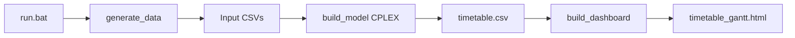

# Smart Timetable Scheduler

Optimization-based school timetable management: sample academic data is generated with **Faker**, scheduling rules are encoded as a **mixed integer program**, and **IBM CPLEX** (via **DOcplex**) produces a weekly timetable. Results are exported as **CSV** and an interactive **HTML dashboard** with Gantt chart, filters, and analytics.

## Project Overview

This application assigns courses to rooms, days, and time periods while respecting teacher, room, and section conflicts. The UI presents KPIs, weekly and entity-specific views, room utilization, teacher workload, conflict checks on the output, and documentation of the real optimization constraints.

## Problem Statement

Colleges need feasible weekly timetables where:

- Each course meets its required number of weekly sessions
- No room double-booking
- No teacher double-booking
- No section (student group) double-booking

The solver also prefers schedules that avoid placing classes in the last period of the day when possible.

## Technologies Used

| Area | Stack |
|------|--------|
| Language | Python |
| Optimization | IBM CPLEX, DOcplex (MIP) |
| Data | Faker, pandas |
| Visualization | Plotly, static HTML/CSS/JS |

## Architecture

```
run.bat
   │
   ├── src/data_generation/generate_data.py  →  output/teachers.csv, rooms.csv, courses.csv
   │
   ├── src/model/build_model.py               →  output/timetable.csv, optimization_summary.json
   │
   └── src/visualization/build_dashboard.py  →  output/timetable_gantt.html, style.css, app.js
```



## Optimization Approach

- **Decision variables:** binary `x[course, room, day, period]` — 1 if that assignment is chosen
- **Objective:** minimize total assignments in period 3 (late-period penalty)
- **Technique:** Mixed Integer Programming (binary variables)

## Constraints (implemented in code)

1. **Course coverage** — each course scheduled exactly `weekly_classes` times per week  
2. **Room exclusivity** — at most one class per room per (day, period)  
3. **Section exclusivity** — at most one class per section per (day, period)  
4. **Teacher exclusivity** — at most one class per teacher per (day, period)  

**Not implemented:** room capacity vs. class size (capacity is stored in `rooms.csv` for reference only).

## Features

- Modern landing page (Home), weekly CSS grid timetable, and Appearance panel (themes, font pairs, pastel fill and border colors — saved in your browser)
- KPI cards and optimization summary (from `optimization_summary.json` when available)
- Weekly timetable grid with filters (teacher, room, course, day)
- Teacher, room, and course grouped views
- Plotly Gantt chart (room timeline, range slider)
- Room utilization and teacher workload charts
- Post-hoc conflict detection on timetable output
- Scheduling rules and technical details panels
- CSV / HTML download links and print-friendly timetable view
- Empty-state HTML when outputs are missing

## Screenshots

After running the pipeline, open `output/timetable_gantt.html` in a browser. (Add screenshots to your portfolio as needed.)

## How to Run

### Windows (recommended)

```bat
run.bat
```

This creates/uses `.TIMEenvTABLE`, installs dependencies, runs all three steps, and opens the dashboard.

### Manual steps (from project root)

```bash
python -m src.data_generation.generate_data
python -m src.model.build_model
python -m src.visualization.build_dashboard
```

Requires a valid **CPLEX** installation licensed for DOcplex.

### Docker

Build runs data → model → dashboard; nginx serves `output/` (see `Dockerfile` and `Deploy/nginx/default.conf`).

### Output files (replace on each run)

The pipeline uses **fixed paths** under `output/` — every run **overwrites** the same filenames (no dated copies). The dashboard step clears old HTML/CSS/JS before rebuilding and drops duplicate `dashboard-data.json` (data is embedded in the HTML). Docker uses a **multi-stage build**: CPLEX runs in the builder stage; the runtime image contains only nginx plus the pruned `output/` tree. Compose **does not mount an output volume**, so each deploy shows exactly what is in the new image. If you previously used the `school_timetable_output` volume, remove it once: `docker volume rm school_timetable_output`.

## Sample Output

| File | Description |
|------|-------------|
| `output/teachers.csv` | Teacher IDs and names |
| `output/rooms.csv` | Room IDs and capacities |
| `output/courses.csv` | Courses, teachers, sections, weekly class count |
| `output/timetable.csv` | Optimized schedule |
| `output/optimization_summary.json` | Solver status, objective, model size |
| `output/timetable_gantt.html` | Full dashboard |
| `output/style.css`, `output/app.js` | Copied assets for offline/nginx serving |

## Project Layout

```
School_Timetable_Fresh/
├── config.py
├── run.bat
├── requirements.txt
├── src/
│   ├── data_generation/generate_data.py
│   ├── model/build_model.py
│   ├── visualization/
│   │   ├── analytics.py
│   │   ├── html_templates.py
│   │   └── build_dashboard.py
│   └── web/
│       ├── style.css
│       └── app.js
└── output/          (generated)
```

## Future Improvements

- Enforce room capacity and enrollment in the model
- Teacher availability and preferences
- UI-triggered generation with progress (requires a small backend or local runner)
- Multi-semester and richer period definitions
- Automated tests for dashboard analytics

## Limitations

- Timetable generation is batch-only (`run.bat` / CLI); the HTML UI does not run CPLEX in the browser
- Loading/progress steps during solve are not shown in the UI (console only during `build_model`)
- Conflict panel validates the **exported** timetable; it does not change the solver
